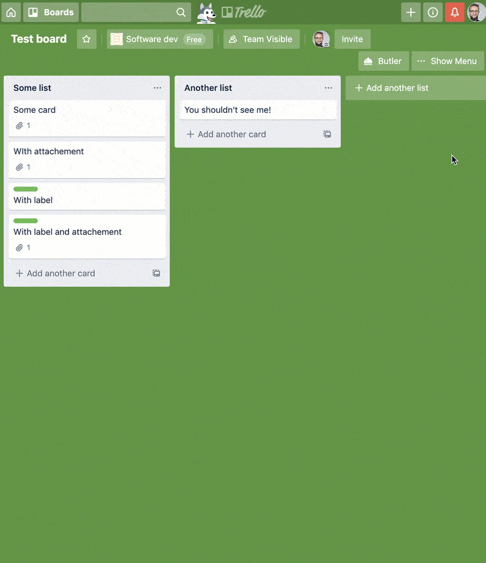
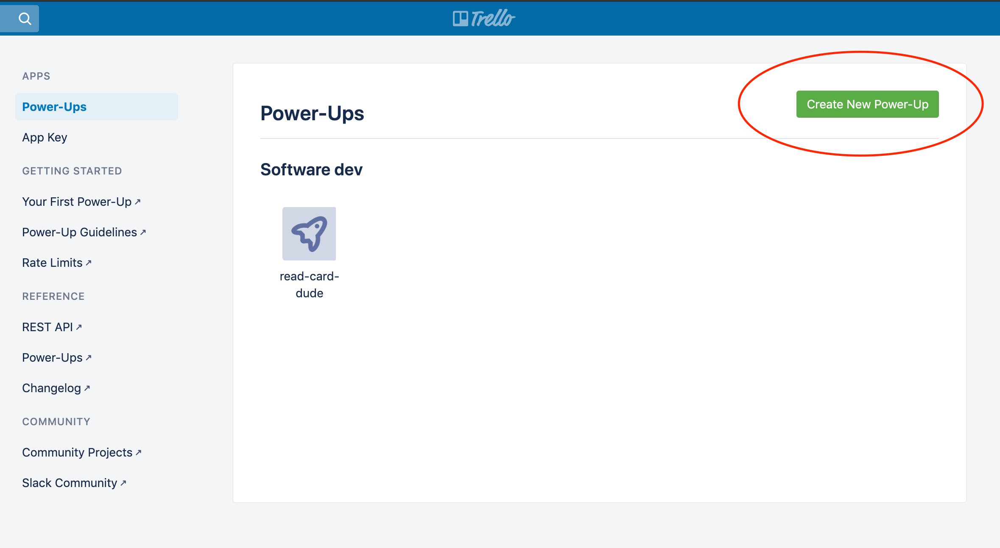
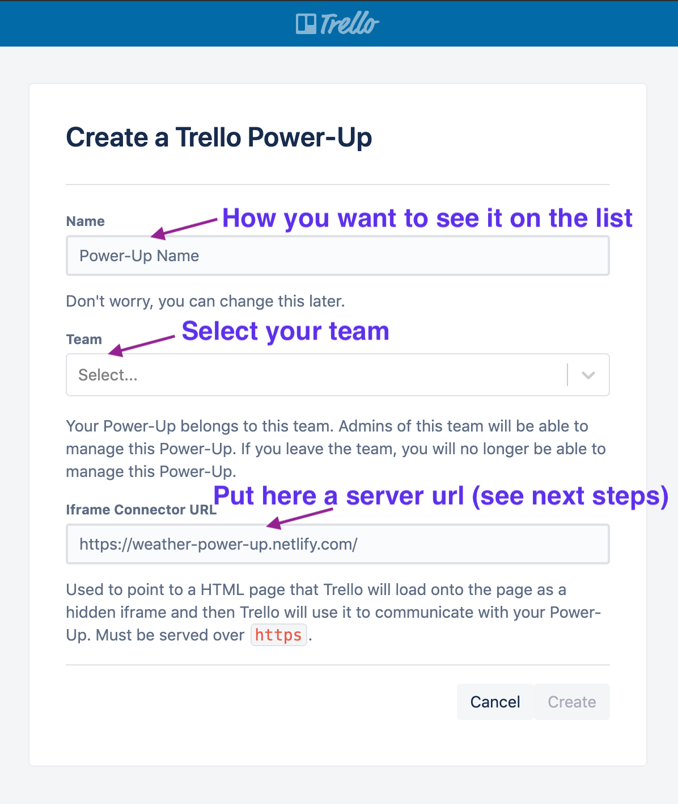
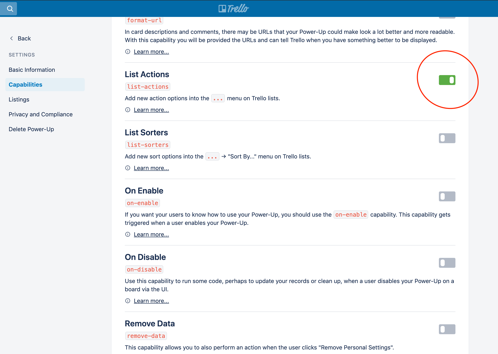
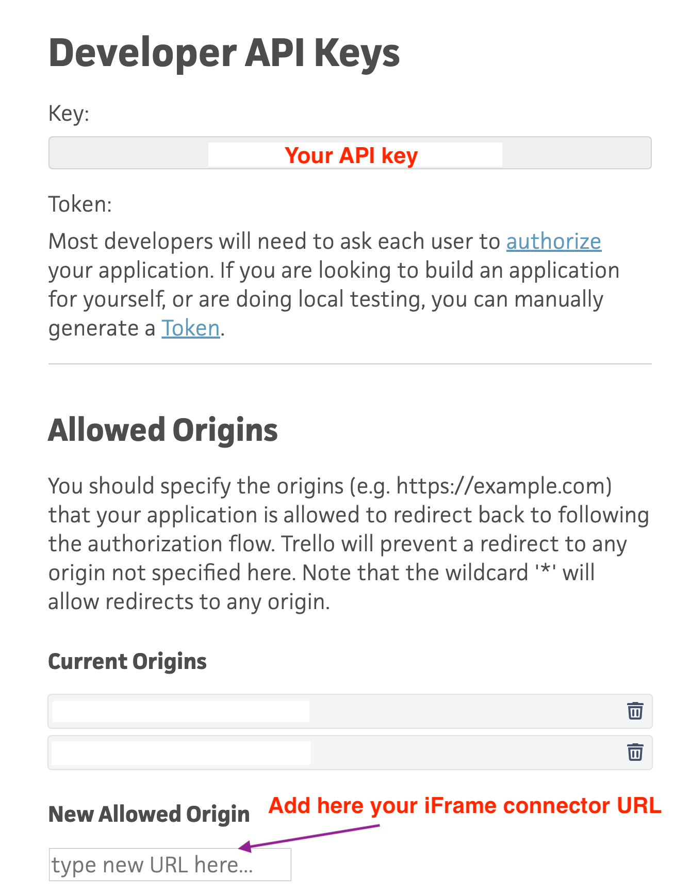
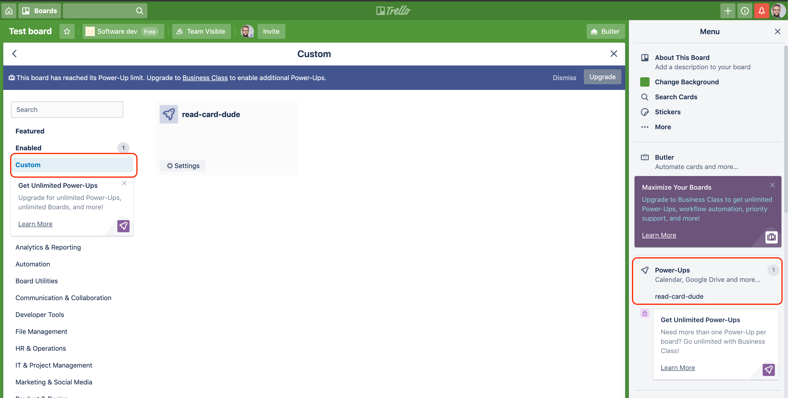
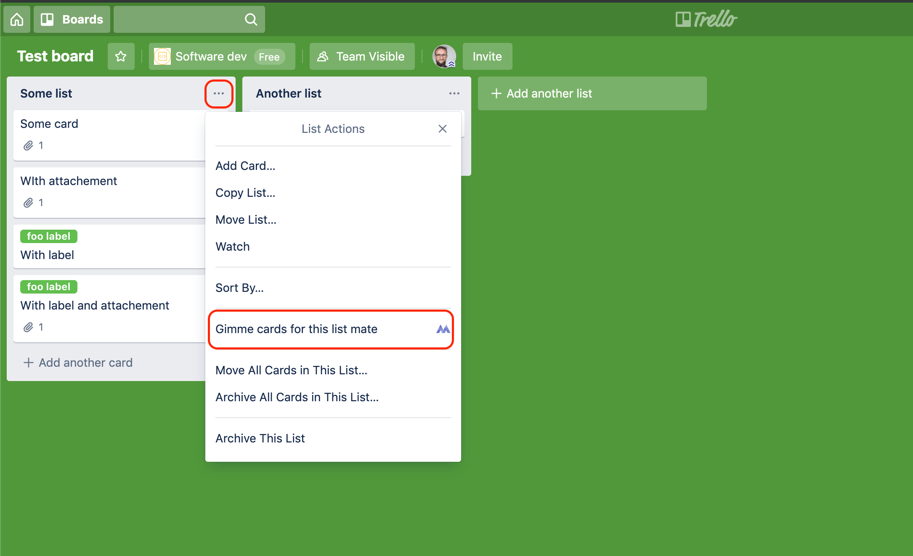

<h1 align="center">Welcome to gimme-cards-mate 👋</h1>
<p>
  
  <a href="https://github.com/michalczukm/trello-gimme-cards-mate#readme" target="_blank">
    
  </a>
  <a href="https://github.com/michalczukm/trello-gimme-cards-mate/graphs/commit-activity" target="_blank">
    
  </a>
  <a href="https://twitter.com/michalczukm" target="_blank">
    
  </a>
</p>

> Trello power-up which allow you to generate formated document filled with your cards on a Trello list.

## In action



In editor you have access all cards on the list and to render functions.
Both should be suggested by autocomplete.

```typescript
type List = {
    name: string,
    cards: {
        id: string,
        name: string,
        desc: string,
        url: string,
        shortUrl: string,
        attachments: { id: string, name: string, url: string, date: string }[],
        labels: { id: string, name: string, color: string }[]
    }[]
};

declare const LIST: List;

declare const render: {
  write(content: string): void,
  newLine(): void;
  writeLine(content: string): void,
  list(items: string[], type: 'ordered' | 'unordered' = 'unordered'): void
}
```

## Adding this Trello power-up to your board
You can use custom (non marketplace power-up) only in the Trello team that you're administrating.

Please make sure you have one, if you want to use this.

1. Visit [trello.com/power-ups/admin](https://trello.com/power-ups/admin) and press `Create new power-up`

1. Fill form, if you want to use my distribution, put **https://michalczukm.github.io/trello-gimme-cards-mate/** as `iFrame connector URL`. Click **Create**.

1. Set power-up capabilities - those are entry points where it can be rendered. Set `list-actions` to true.

1. Visit [trello.com/app-key](https://trello.com/app-key), and add **https://michalczukm.github.io/trello-gimme-cards-mate/** to list of allowed URLs to redirect after authorization flow. 
You can also add there wildcard `*`, but I wouldn't do this if I were you 🤓

1. Go to board which, you'd like to add power-up to. **Please remember that it has to be in the same team**. And add a `custom` power-up

1. *Gimme cards mate* should be available in list meatballs menu. Before first run you'll have to authorize it for reading your data (it reads cards from the list, remember? 🙃).

## Install

```sh
npm install
```

## Usage

**Before** running it:
* ⚠️ prepare your `.env` file. Example is [.env.example](./.env.example)


Run and serve via `webpack-dev-server`
```sh
npm start
```

Build production assets
```sh
npm run build
```

### Running local dev on Trello
To run you local version on Trello you have to expose it on the internet over HTTPS, and use that address as `iFrame connector URL` [(as here)].(#adding-this-trello-power-up-to-your-board)

You can use services like [ngrok](https://ngrok.com/) for that.

For `ngrok` you have to add extra headers when exposing `webpack-dev-server`.

```sh
# assuming that your webpack-dev server runs on port 8080
ngrok http 8080 --host-header="localhost:8080"
```

To make your app complete authorization flow - you have to allow this origin for authorization redirect from Trello in app-key.

Do the same step [(as here)](#adding-this-trello-power-up-to-your-board), but with your own URL.

## More information

### Developing Trello power-ups
* https://tech.trello.com/power-up-tutorial-part-one/
* https://developers.trello.com/reference/#power-ups-intro
* https://glitch.com/@trello

## Author

👤 **Michal Michalczuk**

* Twitter: [@michalczukm](https://twitter.com/michalczukm)
* Github: [@michalczukm](https://github.com/michalczukm)

## Show your support

Give a ⭐️ if this project helped you!

## 📝 License

Copyright © 2019 [Michal Michalczuk](https://github.com/michalczukm).<br />
This project is [MIT](https://github.com/michalczukm/trello-gimme-cards-mate/blob/master/LICENSE) licensed.

***
_This README was generated with ❤️ by [readme-md-generator](https://github.com/kefranabg/readme-md-generator)_